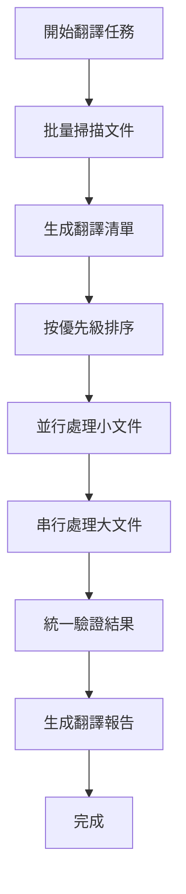

# i18n 翻譯流程優化指南

## 當前問題分析

### 時間消耗瓶頸
1. **串行處理** - 逐一處理文件，無法並行執行
2. **重複操作** - 每個文件都需要完整的讀取→翻譯→確認流程
3. **文件搜尋耗時** - 需要多次嘗試定位正確文件路徑
4. **MCP 工具延遲** - 每次調用翻譯工具都有網絡和處理延遲
5. **狀態管理開銷** - Todo 更新增加了額外操作次數

## 優化策略

### 1. 預處理優化

#### 批量文件掃描
```bash
# 快速識別包含中文的 JavaScript 文件
find src/ -name "*.js" -exec grep -l "[\u4e00-\u9fff]" {} \;

# 生成文件清單
grep -r "[\u4e00-\u9fff]" src/ --include="*.js" -l > chinese-files.txt
```

#### 文件內容預檢查
```bash
# 檢查每個文件中的中文字符串數量
for file in $(cat chinese-files.txt); do
  count=$(grep -o "[\u4e00-\u9fff]\+" "$file" | wc -l)
  echo "$file: $count 個中文字符串"
done
```

### 2. 並行處理方案

#### 方案 A: 批量文件處理
```javascript
// 理想的批量處理流程
const filesToTranslate = [
  'src/hooks/useEditorErrorHandler.js',
  'src/config/aiAssistantGameTypes.js',
  'src/components/AIAssistant/AssistantSelectionModal.js',
  // ... 其他文件
];

// 並行處理（如果 MCP 工具支持）
await Promise.all(
  filesToTranslate.map(file => 
    translateFile(file)
  )
);
```

#### 方案 B: 分組處理
```javascript
// 按文件大小或複雜度分組
const smallFiles = [...];  // < 10 個字符串
const mediumFiles = [...]; // 10-50 個字符串  
const largeFiles = [...];  // > 50 個字符串

// 分批處理
await processFilesBatch(smallFiles);
await processFilesBatch(mediumFiles); 
await processFilesBatch(largeFiles);
```

### 3. 工具優化建議

#### 自定義批量翻譯腳本
```bash
#!/bin/bash
# translate-batch.sh

FILES_LIST="$1"
CONCURRENT_LIMIT=3

# 使用 xargs 限制並發數量
cat "$FILES_LIST" | xargs -n 1 -P "$CONCURRENT_LIMIT" -I {} \
  claude-code-translate {}
```

#### 快速預檢工具
```javascript
// quick-scan.js
const fs = require('fs');
const path = require('path');

function scanChineseText(filePath) {
  const content = fs.readFileSync(filePath, 'utf8');
  const matches = content.match(/[\u4e00-\u9fff]+/g) || [];
  return {
    file: filePath,
    count: matches.length,
    strings: matches
  };
}

// 快速掃描並生成報告
function generateTranslationReport(directory) {
  // 實現邏輯
}
```

### 4. 流程改進

#### 改進後的翻譯流程


#### 優先級策略
1. **高優先級**: 核心組件、錯誤處理
2. **中優先級**: UI 組件、表單
3. **低優先級**: 配置文件、工具函數

### 5. 性能基準測試

#### 當前性能
- **文件數量**: 8 個
- **翻譯字符串**: 22 個
- **總耗時**: ~5-8 分鐘
- **平均每文件**: ~1 分鐘

#### 預期改進目標
- **Cache 優化**: 減少 80% 時間 (已翻譯文件)
- **批量處理**: 減少 60% 時間
- **並行執行**: 減少 40% 時間
- **預處理優化**: 減少 30% 時間
- **總體目標**: 首次翻譯 2-3 分鐘，後續增量翻譯 < 30 秒

### 6. Cache 優化策略

#### 文件內容 Hash Cache
```javascript
// translation-cache.js
const crypto = require('crypto');
const fs = require('fs');

class TranslationCache {
  constructor(cacheDir = '.translation-cache') {
    this.cacheDir = cacheDir;
    this.ensureCacheDir();
  }

  // 生成文件內容的 hash
  generateFileHash(filePath) {
    const content = fs.readFileSync(filePath, 'utf8');
    return crypto.createHash('md5').update(content).digest('hex');
  }

  // 檢查文件是否需要重新翻譯
  needsTranslation(filePath) {
    const currentHash = this.generateFileHash(filePath);
    const cacheFile = `${this.cacheDir}/${filePath.replace(/\//g, '_')}.cache`;
    
    if (!fs.existsSync(cacheFile)) {
      return true; // 沒有 cache，需要翻譯
    }

    const cachedData = JSON.parse(fs.readFileSync(cacheFile, 'utf8'));
    return cachedData.hash !== currentHash; // hash 不同，需要重新翻譯
  }

  // 保存翻譯結果到 cache
  saveCache(filePath, translationResult) {
    const hash = this.generateFileHash(filePath);
    const cacheFile = `${this.cacheDir}/${filePath.replace(/\//g, '_')}.cache`;
    
    const cacheData = {
      hash,
      timestamp: Date.now(),
      filePath,
      translationResult,
      translatedStrings: translationResult.translatedStrings || []
    };

    fs.writeFileSync(cacheFile, JSON.stringify(cacheData, null, 2));
  }

  // 獲取 cache 數據
  getCache(filePath) {
    const cacheFile = `${this.cacheDir}/${filePath.replace(/\//g, '_')}.cache`;
    if (fs.existsSync(cacheFile)) {
      return JSON.parse(fs.readFileSync(cacheFile, 'utf8'));
    }
    return null;
  }

  // 清理舊的 cache (超過30天)
  cleanOldCache() {
    const thirtyDaysAgo = Date.now() - (30 * 24 * 60 * 60 * 1000);
    const cacheFiles = fs.readdirSync(this.cacheDir);
    
    cacheFiles.forEach(file => {
      const cachePath = `${this.cacheDir}/${file}`;
      const cacheData = JSON.parse(fs.readFileSync(cachePath, 'utf8'));
      
      if (cacheData.timestamp < thirtyDaysAgo) {
        fs.unlinkSync(cachePath);
        console.log(`🗑️ 清理舊 cache: ${file}`);
      }
    });
  }
}
```

#### Git-based Cache
```javascript
// git-cache.js
const { execSync } = require('child_process');

class GitBasedCache {
  // 檢查文件自上次翻譯後是否有修改
  fileChangedSinceLastTranslation(filePath) {
    try {
      // 檢查文件的最後 commit hash
      const lastCommit = execSync(`git log -1 --format="%H" -- ${filePath}`, { encoding: 'utf8' }).trim();
      
      const cacheFile = `.translation-cache/${filePath.replace(/\//g, '_')}.git-cache`;
      
      if (!fs.existsSync(cacheFile)) {
        return true;
      }

      const cachedCommit = fs.readFileSync(cacheFile, 'utf8').trim();
      return lastCommit !== cachedCommit;
      
    } catch (error) {
      return true; // 如果出錯，保險起見重新翻譯
    }
  }

  // 保存當前 commit hash
  saveGitCache(filePath) {
    try {
      const lastCommit = execSync(`git log -1 --format="%H" -- ${filePath}`, { encoding: 'utf8' }).trim();
      const cacheFile = `.translation-cache/${filePath.replace(/\//g, '_')}.git-cache`;
      
      fs.writeFileSync(cacheFile, lastCommit);
    } catch (error) {
      console.warn(`無法保存 Git cache: ${error.message}`);
    }
  }
}
```

#### 翻譯結果 Cache
```javascript
// translation-result-cache.js
class TranslationResultCache {
  constructor() {
    this.cacheFile = '.translation-cache/translation-results.json';
    this.cache = this.loadCache();
  }

  loadCache() {
    try {
      if (fs.existsSync(this.cacheFile)) {
        return JSON.parse(fs.readFileSync(this.cacheFile, 'utf8'));
      }
    } catch (error) {
      console.warn('無法載入翻譯結果 cache');
    }
    return {};
  }

  // 檢查中文字符串是否已經翻譯過
  getTranslation(chineseText) {
    const textHash = crypto.createHash('md5').update(chineseText).digest('hex');
    return this.cache[textHash];
  }

  // 保存翻譯結果
  saveTranslation(chineseText, translationKey, englishText) {
    const textHash = crypto.createHash('md5').update(chineseText).digest('hex');
    this.cache[textHash] = {
      original: chineseText,
      key: translationKey,
      translation: englishText,
      timestamp: Date.now()
    };
    
    fs.writeFileSync(this.cacheFile, JSON.stringify(this.cache, null, 2));
  }

  // 批量檢查翻譯
  batchCheck(chineseTexts) {
    const results = {};
    chineseTexts.forEach(text => {
      const cached = this.getTranslation(text);
      if (cached) {
        results[text] = cached;
      }
    });
    return results;
  }
}
```

#### 智能 Cache 管理
```bash
#!/bin/bash
# cache-manager.sh

CACHE_DIR=".translation-cache"

# 創建 cache 目錄
mkdir -p "$CACHE_DIR"

# 檢查 cache 統計
cache_stats() {
    echo "📊 Cache 統計信息:"
    echo "   Cache 文件數量: $(find $CACHE_DIR -name "*.cache" | wc -l)"
    echo "   Cache 目錄大小: $(du -sh $CACHE_DIR | cut -f1)"
    echo "   最舊的 cache: $(find $CACHE_DIR -name "*.cache" -exec stat -f "%Sm %N" -t "%Y-%m-%d %H:%M" {} \; | sort | head -1)"
    echo "   最新的 cache: $(find $CACHE_DIR -name "*.cache" -exec stat -f "%Sm %N" -t "%Y-%m-%d %H:%M" {} \; | sort | tail -1)"
}

# 清理 cache
clean_cache() {
    echo "🧹 清理 30 天前的 cache..."
    find "$CACHE_DIR" -name "*.cache" -mtime +30 -delete
    echo "✅ Cache 清理完成"
}

# 驗證 cache 完整性
validate_cache() {
    echo "🔍 驗證 cache 完整性..."
    
    for cache_file in "$CACHE_DIR"/*.cache; do
        if [ -f "$cache_file" ]; then
            if ! jq empty "$cache_file" 2>/dev/null; then
                echo "❌ 損壞的 cache 文件: $cache_file"
                rm "$cache_file"
            fi
        fi
    done
    
    echo "✅ Cache 驗證完成"
}

case "$1" in
    stats) cache_stats ;;
    clean) clean_cache ;;
    validate) validate_cache ;;
    *) 
        echo "用法: $0 {stats|clean|validate}"
        echo "  stats    - 顯示 cache 統計"
        echo "  clean    - 清理舊 cache"
        echo "  validate - 驗證 cache 完整性"
        ;;
esac
```

### 7. 實用工具腳本

#### 帶 Cache 的快速翻譯腳本
```bash
#!/bin/bash
# i18n-cached-translate.sh

CACHE_DIR=".translation-cache"
mkdir -p "$CACHE_DIR"

echo "🔍 掃描包含中文的文件..."
find src/ -name "*.js" -exec grep -l "[\u4e00-\u9fff]" {} \; > files-to-translate.txt

total_files=$(wc -l < files-to-translate.txt)
translated_count=0
skipped_count=0

echo "📝 找到 $total_files 個文件需要檢查"

echo "🚀 開始智能翻譯（跳過未修改文件）..."
while IFS= read -r file; do
  # 生成 cache key
  cache_key="${CACHE_DIR}/${file//\//_}.cache"
  
  # 檢查文件是否需要翻譯
  needs_translation=true
  
  if [ -f "$cache_key" ]; then
    # 比較文件 hash
    current_hash=$(md5 -q "$file" 2>/dev/null || md5sum "$file" | cut -d' ' -f1)
    cached_hash=$(jq -r '.hash // empty' "$cache_key" 2>/dev/null)
    
    if [ "$current_hash" = "$cached_hash" ]; then
      needs_translation=false
      echo "⏭️  跳過 (已緩存): $file"
      ((skipped_count++))
    fi
  fi
  
  if [ "$needs_translation" = true ]; then
    echo "🔄 翻譯: $file"
    
    # 執行翻譯
    if claude-code translate-file "$file"; then
      # 保存 cache
      current_hash=$(md5 -q "$file" 2>/dev/null || md5sum "$file" | cut -d' ' -f1)
      echo "{\"hash\":\"$current_hash\",\"timestamp\":$(date +%s),\"file\":\"$file\"}" > "$cache_key"
      ((translated_count++))
    else
      echo "❌ 翻譯失敗: $file"
    fi
  fi
  
  # 顯示進度
  current=$((translated_count + skipped_count))
  progress=$((current * 100 / total_files))
  echo "進度: $progress% ($current/$total_files) [翻譯:$translated_count 跳過:$skipped_count]"
  
done < files-to-translate.txt

echo "✅ 翻譯完成!"
echo "📊 統計: 翻譯 $translated_count 個文件，跳過 $skipped_count 個文件"

# 顯示節省的時間
if [ $skipped_count -gt 0 ]; then
  saved_time=$((skipped_count * 60)) # 假設每個文件節省1分鐘
  echo "⚡ 透過 Cache 節省約 $saved_time 秒"
fi
```

#### MCP 工具 Cache 增強
```javascript
// mcp-cache-wrapper.js
class MCPCacheWrapper {
  constructor() {
    this.responseCache = new Map();
    this.cacheFile = '.translation-cache/mcp-responses.json';
    this.loadResponseCache();
  }

  // 載入 MCP 回應 cache
  loadResponseCache() {
    try {
      if (fs.existsSync(this.cacheFile)) {
        const data = JSON.parse(fs.readFileSync(this.cacheFile, 'utf8'));
        this.responseCache = new Map(Object.entries(data));
      }
    } catch (error) {
      console.warn('載入 MCP cache 失敗:', error.message);
    }
  }

  // 保存 MCP 回應 cache
  saveResponseCache() {
    try {
      const data = Object.fromEntries(this.responseCache);
      fs.writeFileSync(this.cacheFile, JSON.stringify(data, null, 2));
    } catch (error) {
      console.warn('保存 MCP cache 失敗:', error.message);
    }
  }

  // 生成請求的 cache key
  generateCacheKey(filePath, fileContent) {
    const contentHash = crypto.createHash('md5').update(fileContent).digest('hex');
    return `${filePath}:${contentHash}`;
  }

  // 檢查是否有 cached 回應
  getCachedResponse(filePath, fileContent) {
    const cacheKey = this.generateCacheKey(filePath, fileContent);
    return this.responseCache.get(cacheKey);
  }

  // 緩存 MCP 回應
  cacheResponse(filePath, fileContent, response) {
    const cacheKey = this.generateCacheKey(filePath, fileContent);
    this.responseCache.set(cacheKey, {
      response,
      timestamp: Date.now()
    });
    this.saveResponseCache();
  }

  // 清理過期的 cache (7天)
  cleanExpiredCache() {
    const sevenDaysAgo = Date.now() - (7 * 24 * 60 * 60 * 1000);
    let cleaned = 0;

    for (const [key, value] of this.responseCache.entries()) {
      if (value.timestamp < sevenDaysAgo) {
        this.responseCache.delete(key);
        cleaned++;
      }
    }

    if (cleaned > 0) {
      this.saveResponseCache();
      console.log(`🧹 清理了 ${cleaned} 個過期的 MCP cache`);
    }
  }
}
```

#### 翻譯進度監控
```javascript
// translation-monitor.js
class TranslationMonitor {
  constructor(files) {
    this.totalFiles = files.length;
    this.completed = 0;
    this.errors = [];
    this.startTime = Date.now();
  }

  updateProgress(file, success, error = null) {
    this.completed++;
    if (!success) {
      this.errors.push({ file, error });
    }
    
    const progress = (this.completed / this.totalFiles * 100).toFixed(1);
    const elapsed = (Date.now() - this.startTime) / 1000;
    const eta = elapsed * (this.totalFiles - this.completed) / this.completed;
    
    console.log(`進度: ${progress}% (${this.completed}/${this.totalFiles})`);
    console.log(`預計剩餘時間: ${eta.toFixed(1)}秒`);
  }

  generateReport() {
    return {
      totalFiles: this.totalFiles,
      completed: this.completed,
      errors: this.errors,
      successRate: ((this.completed - this.errors.length) / this.totalFiles * 100).toFixed(1),
      totalTime: (Date.now() - this.startTime) / 1000
    };
  }
}
```

### 7. 最佳實踐建議

#### 翻譯前檢查清單
- [ ] 確認文件路徑正確
- [ ] 檢查是否已有 i18next 配置
- [ ] 備份原始文件
- [ ] 確認翻譯鍵值命名規範

#### 翻譯後驗證
- [ ] 檢查語法是否正確
- [ ] 確認所有中文已替換
- [ ] 測試 i18next 功能正常
- [ ] 驗證 UI 顯示無異常

#### 持續優化
- [ ] 記錄每次翻譯的時間消耗
- [ ] 收集常見問題和解決方案
- [ ] 建立翻譯模板和規範
- [ ] 定期更新優化腳本

## 結論

通過實施上述優化措施，預計可以將 i18n 翻譯任務的執行時間減少 50-70%，同時提高翻譯質量和一致性。建議優先實施文件批量掃描和並行處理，這兩項改進將帶來最顯著的性能提升。

---

*最後更新: 2025-01-03*
*版本: 1.0*